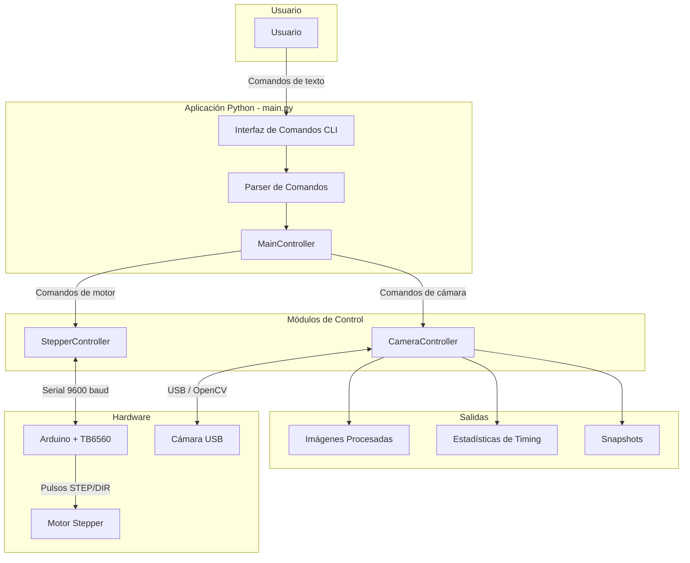
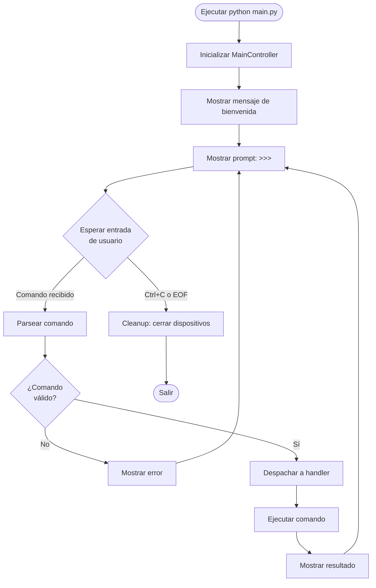
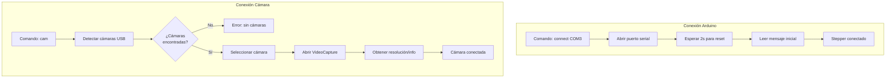
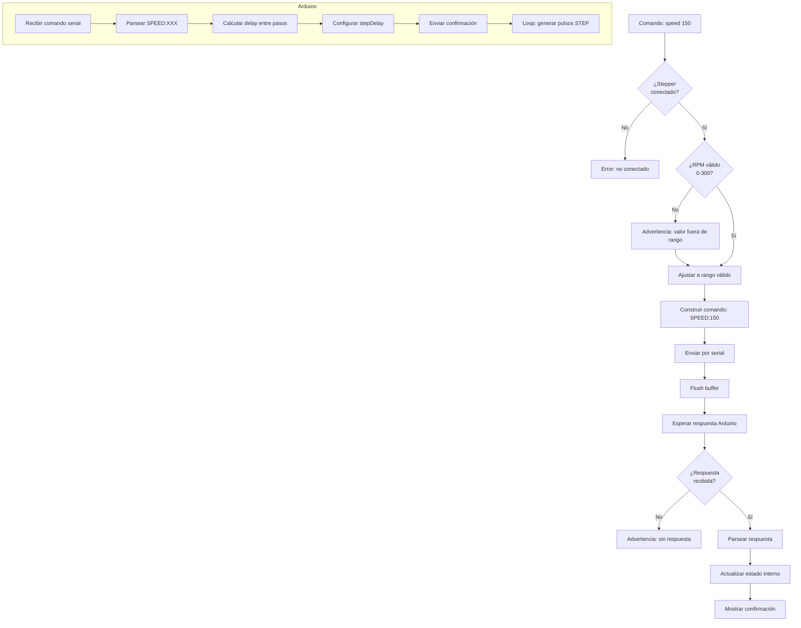
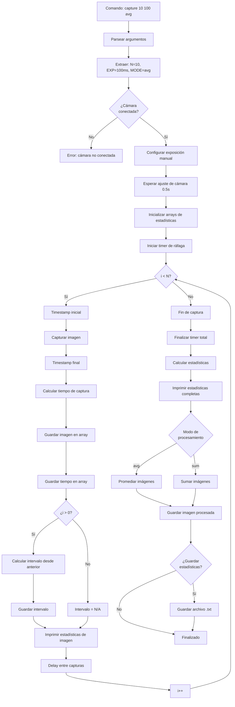
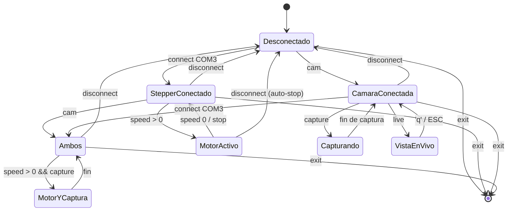
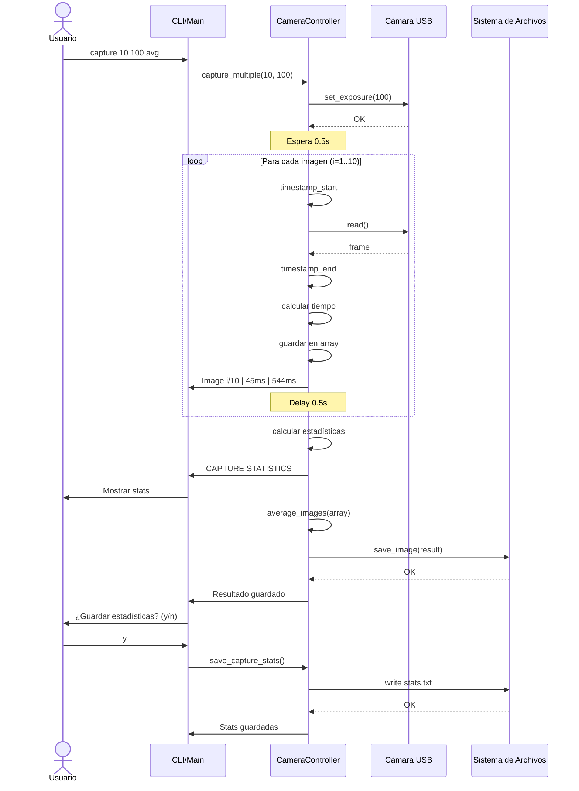
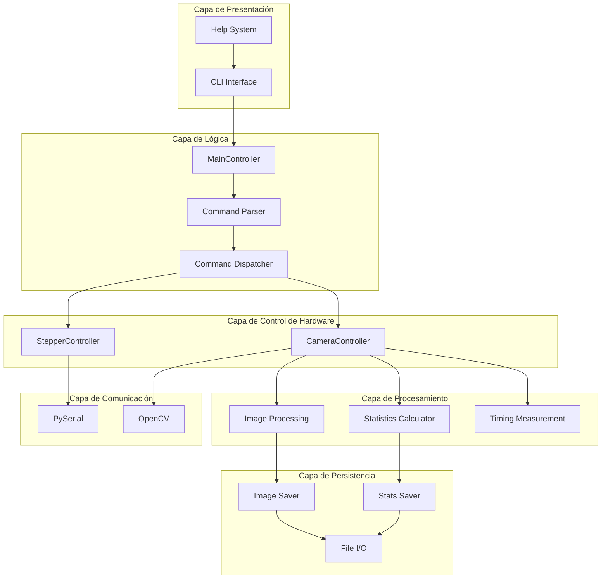

# Diagrama de Flujo del Sistema de Control

## Arquitectura General del Sistema



## Flujo de Inicio del Sistema



## Flujo de Conexión de Dispositivos



## Flujo de Control de Motor Stepper



## Flujo de Captura de Imágenes



## Flujo de Vista en Vivo (Live View)

```mermaid
flowchart TD
    LIVE_CMD[Comando: live] --> CHECK_CAM{¿Cámara<br/>conectada?}
    CHECK_CAM -->|No| ERR[Error: cámara no conectada]
    
    CHECK_CAM -->|Sí| SHOW_INST[Mostrar instrucciones]
    SHOW_INST --> WAIT_USER[Esperar usuario presione tecla]
    WAIT_USER --> INIT_WIN[Crear ventana OpenCV]
    
    INIT_WIN --> LOOP{Loop infinito}
    LOOP --> READ_FRAME[Leer frame de cámara]
    READ_FRAME --> CHECK_FRAME{¿Frame<br/>válido?}
    
    CHECK_FRAME -->|No| ERR_FRAME[Error: frame inválido]
    ERR_FRAME --> EXIT
    
    CHECK_FRAME -->|Sí| OVERLAY[Agregar info overlay]
    OVERLAY --> DISPLAY[Mostrar en ventana]
    DISPLAY --> KEY[Leer tecla con waitKey(1)]
    
    KEY --> CHECK_KEY{¿Qué tecla?}
    CHECK_KEY -->|'q' o ESC| EXIT[Salir de live view]
    CHECK_KEY -->|'s'| SNAP[Guardar snapshot]
    CHECK_KEY -->|Otra| LOOP
    
    SNAP --> GEN_NAME[Generar nombre con timestamp]
    GEN_NAME --> SAVE_SNAP[Guardar snapshot]
    SAVE_SNAP --> PRINT_SNAP[Imprimir confirmación]
    PRINT_SNAP --> LOOP
    
    EXIT --> DESTROY[Destruir ventanas OpenCV]
    DESTROY --> CLEAR[Limpiar buffers]
    CLEAR --> DONE[Retornar a prompt]
```

## Flujo de Procesamiento de Imágenes

```mermaid
flowchart TD
    START[Array de imágenes capturadas] --> CHECK{¿Modo de<br/>procesamiento?}
    
    subgraph "Promediado (avg)"
        AVG_START[Modo: average] --> CONVERT_F[Convertir a float]
        CONVERT_F --> MEAN[np.mean(images, axis=0)]
        MEAN --> CONVERT_U8[Convertir a uint8]
        CONVERT_U8 --> AVG_RESULT[Imagen promediada]
    end
    
    subgraph "Suma (sum)"
        SUM_START[Modo: sum] --> SUM_F[Sumar como float64]
        SUM_F --> NORMALIZE{¿Normalizar?}
        NORMALIZE -->|Sí| NORM[Normalizar 0-255]
        NORMALIZE -->|No| CLIP[Clip 0-255]
        NORM --> SUM_RESULT[Imagen sumada]
        CLIP --> SUM_RESULT
    end
    
    CHECK -->|avg| AVG_START
    CHECK -->|sum| SUM_START
    
    AVG_RESULT --> SAVE
    SUM_RESULT --> SAVE
    
    SAVE[cv2.imwrite] --> TIMESTAMP[Generar nombre con timestamp]
    TIMESTAMP --> FILE[Guardar archivo JPG]
```

## Estados del Sistema



## Diagrama de Secuencia - Captura Completa



## Diagrama de Componentes



## Leyenda de Símbolos

- **Rectángulos**: Procesos o acciones
- **Rombos**: Decisiones o condiciones
- **Círculos**: Puntos de inicio/fin
- **Flechas sólidas**: Flujo de control
- **Flechas punteadas**: Flujo de datos
- **Subgraphs**: Agrupación de componentes relacionados
